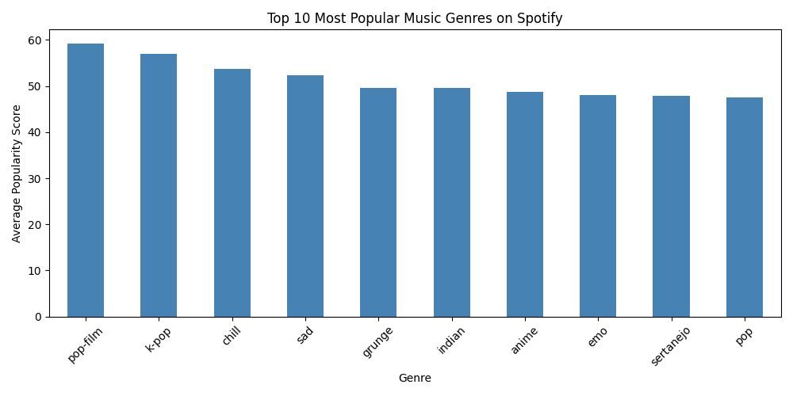
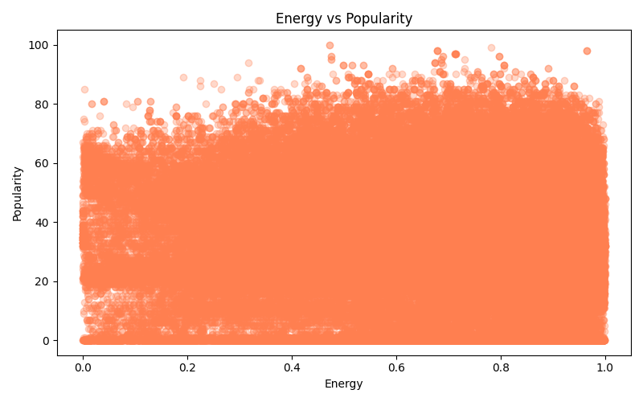
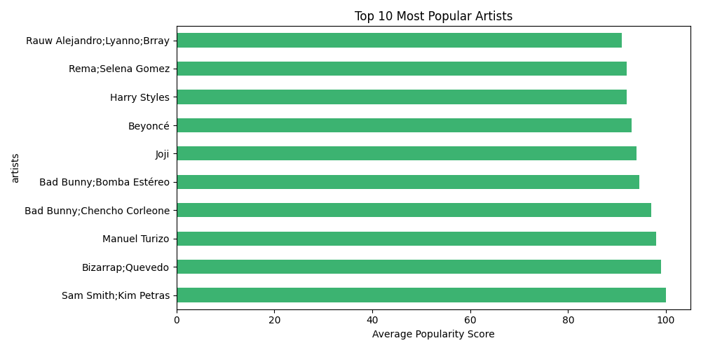

# Spotify Data Analysis

## Overview
Exploratory analysis of 114,000 Spotify tracks to find what makes a song popular.

## Tools Used
- Python, Pandas, Matplotlib, Seaborn
- SQL (SQLite)

## Key Findings
- Pop-film is the #1 most popular genre (avg score: 59.28)
- Explicit songs score slightly higher in popularity (36.45 vs 32.94)
- The Beatles have the most songs in the dataset (279 songs)
- Higher energy songs tend to score higher in popularity

## Charts

